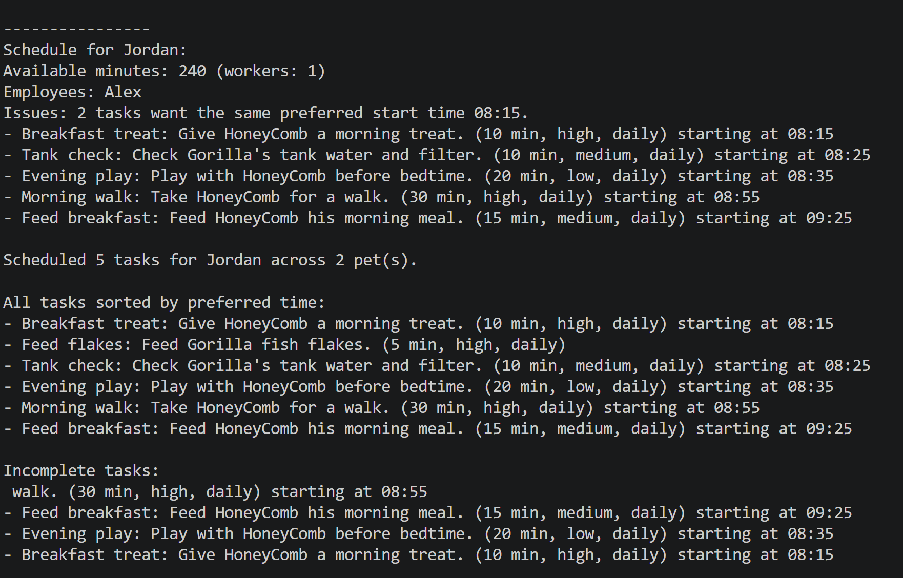

# PawPal+ (Module 2 Project)

You are building **PawPal+**, a Streamlit app that helps a pet owner plan care tasks for their pet.

## Scenario

A busy pet owner needs help staying consistent with pet care. They want an assistant that can:

- Track pet care tasks (walks, feeding, meds, enrichment, grooming, etc.)
- Consider constraints (time available, priority, owner preferences)
- Produce a daily plan and explain why it chose that plan

Your job is to design the system first (UML), then implement the logic in Python, then connect it to the Streamlit UI.

## What you will build

Your final app should:

- Let a user enter basic owner + pet info
- Let a user add/edit tasks (duration + priority at minimum)
- Generate a daily schedule/plan based on constraints and priorities
- Display the plan clearly (and ideally explain the reasoning)
- Include tests for the most important scheduling behaviors

## Getting started

### Setup

```bash
python -m venv .venv
source .venv/bin/activate  # Windows: .venv\Scripts\activate
pip install -r requirements.txt
```

### Suggested workflow

1. Read the scenario carefully and identify requirements and edge cases.
2. Draft a UML diagram (classes, attributes, methods, relationships).
3. Convert UML into Python class stubs (no logic yet).
4. Implement scheduling logic in small increments.
5. Add tests to verify key behaviors.
6. Connect your logic to the Streamlit UI in `app.py`.
7. Refine UML so it matches what you actually built.

### Smarter Scheduling

- Schedule tasks by preferred start time first, then by priority, so time-sensitive care is handled before less urgent work.
- Support recurring daily and weekly tasks by automatically creating the next occurrence when a task is marked complete.
- Filter tasks by pet or completion status to make task lists easier to inspect and schedule.
- Detect lightweight conflicts for duplicate preferred or assigned start times and warn instead of crashing.

### Testing PawPal+

Run the full test suite with:

```bash
python -m pytest
```

The tests cover key scheduling behavior in `pawpal_system.py`:

- recurrence logic for daily tasks when marking a task complete
- sorting tasks by preferred start time and priority
- conflict detection for duplicate preferred or scheduled start times
- task filtering by pet and completion status

Confidence level: 4/5 — the suite covers happy paths and important edge cases, but no test suite can guarantee 100% coverage.

### Features

Implemented scheduling and task management features include:

- Sorting by time: tasks are ordered using preferred start time first, then by priority and duration.
- Conflict warnings: the planner detects duplicate preferred or scheduled start times and reports issues instead of failing.
- Daily recurrence: recurring tasks automatically generate the next occurrence when a task is marked complete.
- Owner/pet task aggregation: tasks are retrieved and filtered across all pets owned by the same owner.
- Task filtering: supports task queries by pet name and completion status.
- Employee-aware capacity: available minutes are adjusted by the number of assigned employees to model workload capacity.


### 📸 Demo
 <a href="Demo_Streamlit.png" target = "_blank"></a>
